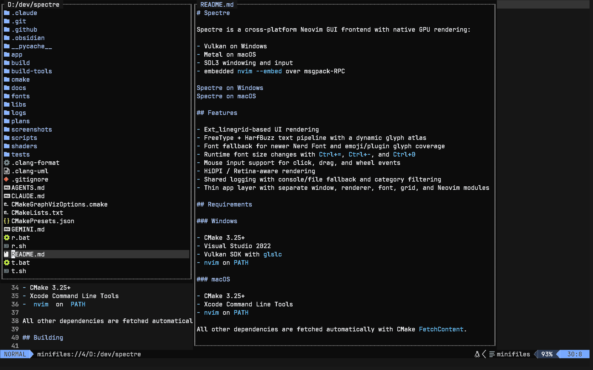
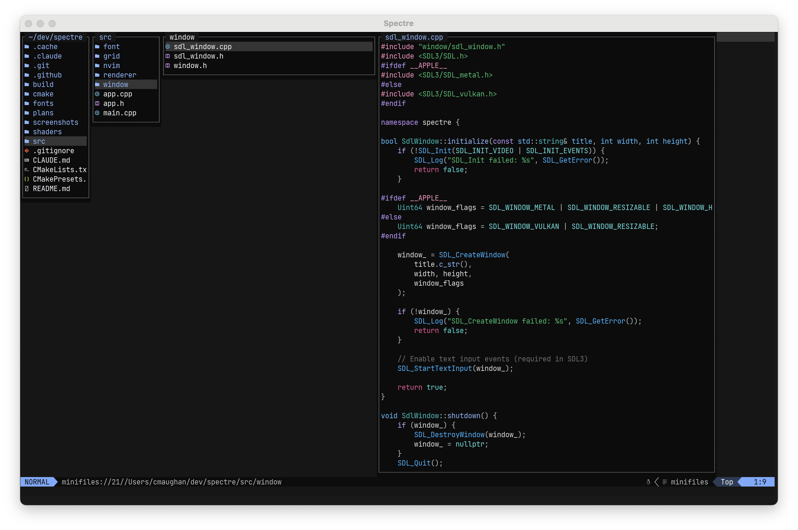
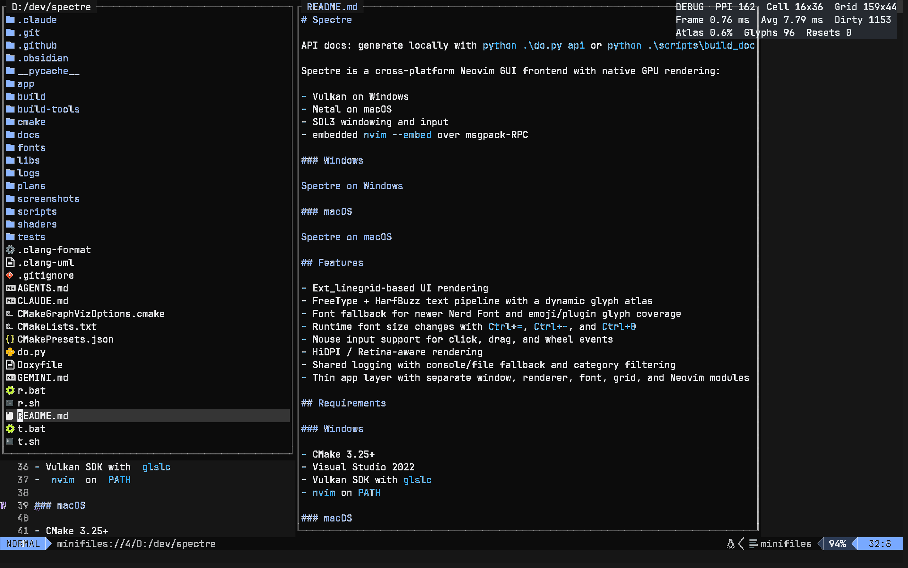
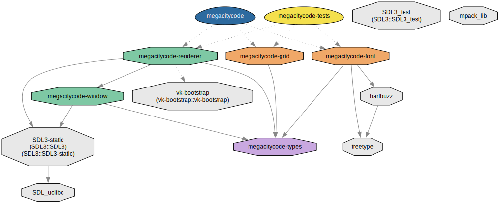
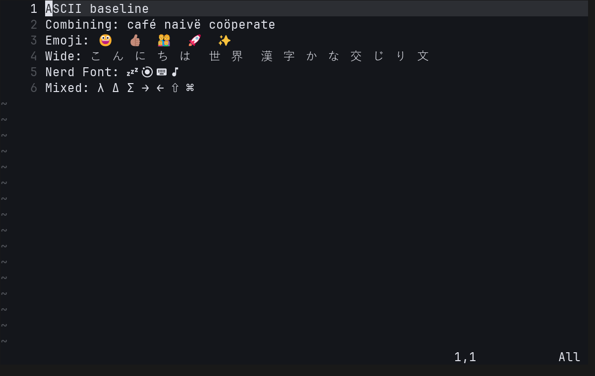

# Spectre

API docs: **[cmaughan.github.io/spectre](https://cmaughan.github.io/spectre)** — or generate locally with `python scripts/gen_api_docs.py`.

Spectre is a cross-platform Neovim GUI frontend with native GPU rendering:

- Vulkan on Windows
- Metal on macOS
- SDL3 windowing and input
- embedded `nvim --embed` over msgpack-RPC

### Windows



### macOS



## Features

- Ext_linegrid-based UI rendering
- FreeType + HarfBuzz text pipeline with a dynamic glyph atlas
- Font fallback for newer Nerd Font and emoji/plugin glyph coverage
- Runtime font size changes with `Ctrl+=`, `Ctrl+-`, and `Ctrl+0`
- Mouse input support for click, drag, and wheel events
- HiDPI / Retina-aware rendering
- Shared logging with console/file fallback and category filtering
- Thin app layer with separate window, renderer, font, grid, and Neovim modules

## Requirements

### Windows

- CMake 3.25+
- Visual Studio 2022
- Vulkan SDK with `glslc`
- `nvim` on `PATH`

### macOS

- CMake 3.25+
- Xcode Command Line Tools
- `nvim` on `PATH`

All other dependencies are fetched automatically with CMake `FetchContent`.

## Building

### Windows

Debug:

```powershell
cmake --preset default
cmake --build build --config Debug --parallel
```

Release:

```powershell
cmake --preset release
cmake --build build --config Release --parallel
```

### macOS

Debug:

```bash
cmake --preset mac-debug
cmake --build build --parallel
```

Release:

```bash
cmake --preset mac-release
cmake --build build --parallel
```

## Running

### Windows

Debug:

```powershell
.\build\Debug\spectre.exe
```

Release:

```powershell
.\build\Release\spectre.exe
```

To open a console window for logs:

```powershell
.\build\Release\spectre.exe --console
```

### macOS

```bash
./build/spectre
```

Spectre starts an embedded Neovim child process automatically.

## Convenience Scripts

Root wrappers:

```powershell
r.bat
r.bat --console
r.bat release --console
t.bat
t.bat both
```

```bash
sh ./r.sh
sh ./r.sh release
sh ./t.sh
sh ./t.sh both
```

The root wrappers delegate to the larger scripts under `scripts/`.

## Testing

The repository includes lightweight native tests for grid logic, redraw parsing, input translation, RPC behavior, renderer state, and Unicode width conformance against headless Neovim.

### Windows

Default is `Debug`:

```powershell
scripts\run_tests.bat
```

Other modes:

```powershell
scripts\run_tests.bat release
scripts\run_tests.bat both
scripts\run_tests.bat --reconfigure
```

### macOS

Default is `Debug`:

```bash
./scripts/run_tests.sh
```

Other modes:

```bash
./scripts/run_tests.sh release
./scripts/run_tests.sh both
./scripts/run_tests.sh --reconfigure
```

The test scripts reuse the existing CMake cache when possible and only reconfigure when needed.

The CTest suite also includes:

- an app startup smoke test when `nvim` is available on `PATH`
- a render snapshot regression test when the platform reference image exists under `tests/render/reference/`

## Render Snapshots

Spectre can now run deterministic render-snapshot tests by capturing pixels directly from the renderer output instead of taking a desktop screenshot.

Example compare run:

```powershell
.\build\Debug\spectre.exe --console --render-test D:\dev\spectre\tests\render\basic-view.toml
```

Bless a new reference image:

```powershell
.\build\Debug\spectre.exe --console --render-test D:\dev\spectre\tests\render\basic-view.toml --bless-render-test
```

Update the documentation screenshot for the current platform:

```powershell
python .\scripts\update_screenshot.py
```

Notes:

- `update_screenshot.py` uses the presentation-oriented `tests/render/readme-hero.toml` scenario by default, so it captures your normal Neovim theme and statusline instead of the clean `-u NONE --noplugin` regression setup.
- The deterministic render regression scenarios remain under `tests/render/` and continue to use fixed startup settings for stable compare/bless behavior.

Behavior:

- the scenario fixes window size, font, and Neovim startup commands
- Spectre waits for redraw activity to settle
- the renderer reads back the presented frame
- output is compared against a platform-specific reference image
- `actual`, `diff`, and `report` artifacts are written under `tests/render/out/`

Reference images live under `tests/render/reference/` with platform suffixes like `basic-view.windows.bmp` and `basic-view.macos.bmp`.

Current scenarios:

- `basic-view`: line numbers, signcolumn, cursorline, and baseline text layout
- `cmdline-view`: bottom-row command-line rendering
- `unicode-view`: graphemes, emoji, wide glyphs, and Nerd Font/plugin icons

## Logging

Spectre now uses a shared repo-local logger across the app, RPC/process layer, windowing, font stack, and renderers.

Environment controls:

```powershell
$env:SPECTRE_LOG = "debug"
$env:SPECTRE_LOG_CATEGORIES = "app,rpc,font"
$env:SPECTRE_LOG_FILE = "logs\\spectre.log"
```

Notes:

- Default level is `info`.
- Categories are comma-separated.
- GUI launches without a console will fall back to a log file automatically.
- The DPI diagnostics in the window layer are now `debug`-only instead of always-on.

## Debug Overlay

Press `F12` to toggle the built-in debug overlay.

It renders through the normal text and atlas path and exposes the state that tends to matter most while working on UI and performance issues:

- display DPI
- cell size
- grid size
- last frame time
- rolling average frame time
- dirty-cell count from the last flush
- atlas usage, glyph count, and reset count

Windows example:



This is useful when changing startup, redraw, or renderer code because it makes "why is this redrawing?" and "what size are we actually rendering at?" visible without attaching a debugger.

To refresh the overlay screenshot locally:

```powershell
python .\scripts\update_screenshot.py --scenario tests\render\readme-overlay.toml --output screenshots\spectre-overlay-pc.png
```

## Project Layout

```text
spectre/
├── app/                    # App startup and main orchestration
├── libs/
│   ├── spectre-types/      # Shared POD types and event structs
│   ├── spectre-window/     # Window abstraction and SDL implementation
│   ├── spectre-renderer/   # Public renderer API and platform backends
│   ├── spectre-font/       # Font loading, shaping, glyph cache
│   ├── spectre-grid/       # Cell grid and highlight state
│   └── spectre-nvim/       # Neovim process, RPC, redraw handling, input
├── shaders/                # Vulkan and Metal shader sources
├── fonts/                  # Bundled font assets copied next to the app
├── tests/                  # Native test executable and fixture helpers
└── scripts/                # Build/test convenience scripts
```

For a guided human-facing overview of the repo structure, generated diagrams, and validation entry points, see [docs/module-map.md](docs/module-map.md).

## CI

GitHub Actions builds and tests the project on:

- Windows
- macOS

The workflow uses the same repo-local test scripts as local development, including the startup smoke test.

## Notes

- Windows uses a multi-config Visual Studio generator through `CMakePresets.json`.
- The renderer boundary is owned by `spectre-renderer`; app code should not include backend-private headers.
- Grapheme handling is much better than the original single-codepoint path, but broad Unicode width conformance against Neovim is still future hardening work.
- Visual regression testing now prefers direct swapchain/drawable readback over desktop screenshots so comparisons stay deterministic across window-manager state.

## Architecture Diagrams

Regenerate with `python scripts/build_docs.py`.

### CMake Target Dependencies



### Class Diagram


### API Docs

The live API reference is published automatically to **[cmaughan.github.io/spectre](https://cmaughan.github.io/spectre)** on every push to `main`.

To generate locally:

```bash
python scripts/gen_api_docs.py
```

This writes a local Doxygen site to `docs/api/index.html`.

## Unicode Snapshot Example

Reference image:



What the render smoke does:

- launches a deterministic Neovim UI scenario at a fixed size with fixed fonts and commands
- waits for redraw activity to settle instead of capturing a half-initialized frame
- reads pixels back from the renderer output directly, not from the desktop compositor
- compares the captured image against a blessed platform reference
- writes `actual`, `diff`, and `report` artifacts under `tests/render/out/`

Why this is useful:

- it catches visual regressions that ordinary unit tests miss, such as tofu, broken fallback fonts, missing line numbers, layout shifts, or highlight mistakes
- the `diff` artifact makes it obvious what changed and roughly how much changed
- the `report` gives a mechanical pass/fail threshold instead of relying on guesswork
- `--bless-render-test` gives a controlled way to accept intentional visual changes

Why this helps agents:

- agents can change rendering, shaping, fallback fonts, cursor logic, or redraw handling and then immediately check whether the visible UI still matches the expected reference
- it reduces the risk of "looks fine in code review, obviously broken on screen" regressions
- it gives a shared, deterministic artifact for review instead of relying on hand-run screenshots or subjective descriptions
