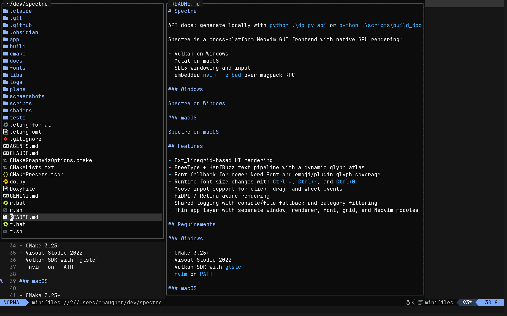
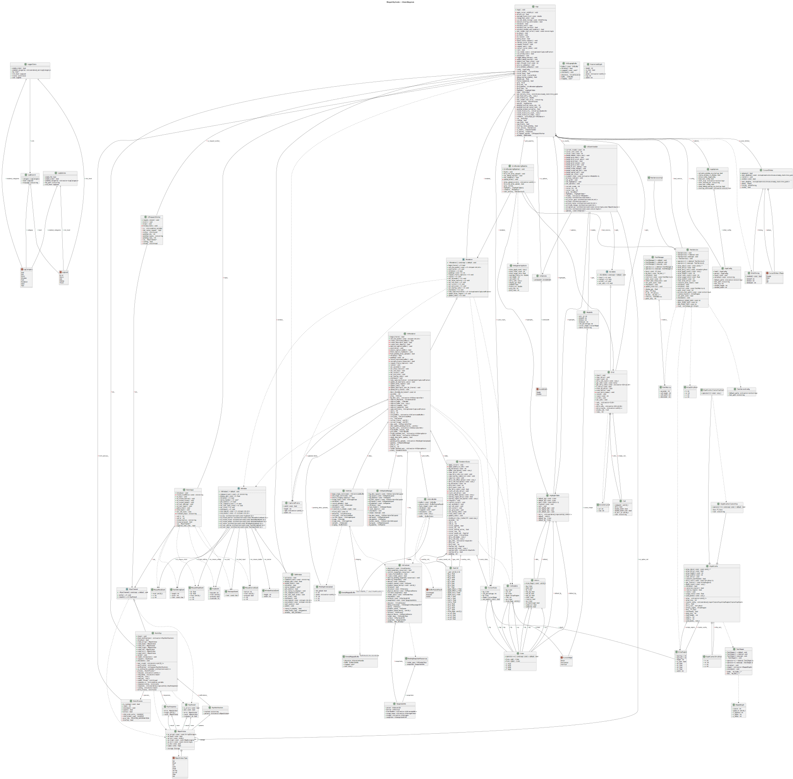

# MegaCityCode

API docs: **[chrismaughan.com/megacitycode](http://chrismaughan.com/megacitycode/)** — or generate locally with `python scripts/gen_api_docs.py`.

MegaCityCode is a cross-platform native 3D viewer with retained font and grid foundations:

- Vulkan on Windows
- Metal on macOS
- SDL3 windowing and input
- a fixed-camera scene path for visualization work

### Windows


### macOS



## Features

- Fixed-camera 3D plane rendering in the Vulkan backend
- FreeType + HarfBuzz text pipeline with a dynamic glyph atlas
- Font fallback for newer Nerd Font and emoji/plugin glyph coverage
- Runtime font size changes with `Ctrl+=`, `Ctrl+-`, and `Ctrl+0`
- Mouse input support for click, drag, and wheel events
- HiDPI / Retina-aware rendering
- Shared logging with console/file fallback and category filtering
- Thin app layer with separate window, renderer, font, and grid modules

## Requirements

### Windows

- CMake 3.25+
- Visual Studio 2022
- Vulkan SDK with `glslc`

### macOS

- CMake 3.25+
- Xcode Command Line Tools

All other dependencies are fetched automatically with CMake `FetchContent`.

## Building

### Windows

Debug:

```powershell
cmake --preset default
cmake --build build --config Debug --parallel
```

Release:

```powershell
cmake --preset release
cmake --build build --config Release --parallel
```

### macOS

Debug:

```bash
cmake --preset mac-debug
cmake --build build --parallel
```

Release:

```bash
cmake --preset mac-release
cmake --build build --parallel
```

## Running

### Windows

Debug:

```powershell
.\build\Debug\megacitycode.exe
```

Release:

```powershell
.\build\Release\megacitycode.exe
```

To open a console window for logs:

```powershell
.\build\Release\megacitycode.exe --console
```

### macOS

```bash
./build/megacitycode
```

MegaCityCode starts directly into the current visualization scene.

## Convenience Scripts

Root wrappers:

```powershell
r.bat
r.bat --console
r.bat release --console
t.bat
t.bat both
```

```bash
sh ./r.sh
sh ./r.sh release
sh ./t.sh
sh ./t.sh both
```

The root wrappers delegate to the larger scripts under `scripts/`.

## Testing

The repository includes lightweight native tests for config parsing, retained grid storage, renderer helpers, snapshot parsing, and renderer state utilities that are still kept around internally.

### Windows

Default is `Debug`:

```powershell
scripts\run_tests.bat
```

Other modes:

```powershell
scripts\run_tests.bat release
scripts\run_tests.bat both
scripts\run_tests.bat --reconfigure
```

### macOS

Default is `Debug`:

```bash
./scripts/run_tests.sh
```

Other modes:

```bash
./scripts/run_tests.sh release
./scripts/run_tests.sh both
./scripts/run_tests.sh --reconfigure
```

The test scripts reuse the existing CMake cache when possible and only reconfigure when needed.

The CTest suite also includes:

- an app startup smoke test
- a render snapshot regression test for the fixed plane scene when the platform reference image exists under `tests/render/reference/`

## Render Snapshots

MegaCityCode can now run deterministic render-snapshot tests by capturing pixels directly from the renderer output instead of taking a desktop screenshot.

Example compare run:

```powershell
.\build\Debug\megacitycode.exe --console --render-test D:\dev\megacitycode\tests\render\plane-view.toml
```

Bless a new reference image:

```powershell
.\build\Debug\megacitycode.exe --console --render-test D:\dev\megacitycode\tests\render\plane-view.toml --bless-render-test
```

Update the documentation screenshot for the current platform:

```powershell
python .\scripts\update_screenshot.py
```

Notes:

- The deterministic render regression scenario lives under `tests/render/plane-view.toml`.
- The current render path is scene-driven rather than text/grid-driven.

Behavior:

- the scenario fixes window size and capture tolerances
- MegaCityCode waits briefly for the scene to settle
- the renderer reads back the presented frame
- output is compared against a platform-specific reference image
- `actual` and `report` artifacts are written under `tests/render/out/`

Reference images live under `tests/render/reference/` with platform suffixes like `plane-view.windows.bmp` and `plane-view.macos.bmp`.

Current scenarios:

- `plane-view`: a fixed 3D plane viewed from a 45-degree elevated camera

## Logging

MegaCityCode now uses a shared repo-local logger across the app, RPC/process layer, windowing, font stack, and renderers.

Environment controls:

```powershell
$env:MEGACITYCODE_LOG = "debug"
$env:MEGACITYCODE_LOG_CATEGORIES = "app,rpc,font"
$env:MEGACITYCODE_LOG_FILE = "logs\\megacitycode.log"
```

Notes:

- Default level is `info`.
- Categories are comma-separated.
- GUI launches without a console will fall back to a log file automatically.
- The DPI diagnostics in the window layer are now `debug`-only instead of always-on.

## Project Layout

```text
megacitycode/
├── app/                    # App startup and main orchestration
├── libs/
│   ├── megacitycode-types/      # Shared POD types and event structs
│   ├── megacitycode-window/     # Window abstraction and SDL implementation
│   ├── megacitycode-renderer/   # Public renderer API and platform backends
│   ├── megacitycode-font/       # Font loading, shaping, glyph cache
│   └── megacitycode-grid/       # Thin retained cell storage for future text work
├── shaders/                # Vulkan and Metal shader sources
├── fonts/                  # Bundled font assets copied next to the app
├── tests/                  # Native test executable and fixture helpers
└── scripts/                # Build/test convenience scripts
```

For a guided human-facing overview of the repo structure, generated diagrams, and validation entry points, see [docs/module-map.md](docs/module-map.md).

## CI

GitHub Actions builds and tests the project on:

- Windows
- macOS

The workflow uses the same repo-local test scripts as local development, including the startup smoke test.

## Notes

- Windows uses a multi-config Visual Studio generator through `CMakePresets.json`.
- The renderer boundary is owned by `megacitycode-renderer`; app code should not include backend-private headers.
- The font and grid layers are retained for future text work, but the current viewer render path is scene-driven rather than cell-driven.
- Visual regression testing now prefers direct swapchain/drawable readback over desktop screenshots so comparisons stay deterministic across window-manager state.

## Architecture Diagrams

Regenerate with `python scripts/build_docs.py`.

### CMake Target Dependencies


### Class Diagram



### API Docs

The live API reference is published automatically to **[chrismaughan.com/megacitycode](http://chrismaughan.com/megacitycode/)** on every push to `main`.

To generate locally:

```bash
python scripts/gen_api_docs.py
```

This writes a local Doxygen site to `docs/api/index.html`.

## Plane Snapshot Example

Reference image:


What the render smoke does:

- launches the fixed 3D plane scene at a deterministic size
- waits briefly for the renderer to settle instead of capturing a half-initialized frame
- reads pixels back from the renderer output directly, not from the desktop compositor
- compares the captured image against a blessed platform reference
- writes `actual` and `report` artifacts under `tests/render/out/`

Why this is useful:

- it catches visual regressions that ordinary unit tests miss, such as camera, shading, or material drift
- the `report` gives a mechanical pass/fail threshold instead of relying on guesswork
- `--bless-render-test` gives a controlled way to accept intentional visual changes

Why this helps agents:

- agents can change rendering, shaping, fallback fonts, cursor logic, or redraw handling and then immediately check whether the visible UI still matches the expected reference
- it reduces the risk of "looks fine in code review, obviously broken on screen" regressions
- it gives a shared, deterministic artifact for review instead of relying on hand-run screenshots or subjective descriptions
