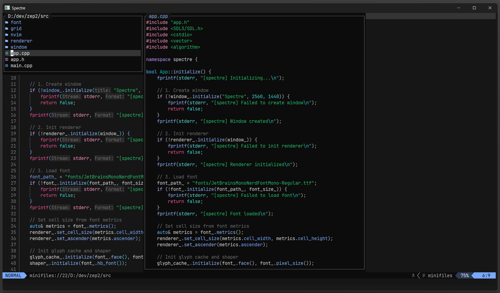

# Spectre

Spectre is a cross-platform Neovim GUI frontend with native GPU rendering:

- Vulkan on Windows
- Metal on macOS
- SDL3 windowing and input
- embedded `nvim --embed` over msgpack-RPC




## Features

- Ext_linegrid-based UI rendering
- FreeType + HarfBuzz text pipeline with a dynamic glyph atlas
- Runtime font size changes with `Ctrl+=`, `Ctrl+-`, and `Ctrl+0`
- Mouse input support for click, drag, and wheel events
- HiDPI / Retina-aware rendering
- Thin app layer with separate window, renderer, font, grid, and Neovim modules

## Requirements

### Windows

- CMake 3.25+
- Visual Studio 2022
- Vulkan SDK with `glslc`
- `nvim` on `PATH`

### macOS

- CMake 3.25+
- Xcode Command Line Tools
- `nvim` on `PATH`

All other dependencies are fetched automatically with CMake `FetchContent`.

## Building

### Windows

Debug:

```powershell
cmake --preset default
cmake --build build --config Debug --parallel
```

Release:

```powershell
cmake --preset release
cmake --build build --config Release --parallel
```

### macOS

Debug:

```bash
cmake --preset mac-debug
cmake --build build --parallel
```

Release:

```bash
cmake --preset mac-release
cmake --build build --parallel
```

## Running

### Windows

Debug:

```powershell
.\build\Debug\spectre.exe
```

Release:

```powershell
.\build\Release\spectre.exe
```

To open a console window for logs:

```powershell
.\build\Release\spectre.exe --console
```

### macOS

```bash
./build/spectre
```

Spectre starts an embedded Neovim child process automatically.

## Testing

The repository includes lightweight native tests for grid logic, redraw parsing, and input translation.

### Windows

Default is `Debug`:

```powershell
scripts\run_tests.bat
```

Other modes:

```powershell
scripts\run_tests.bat release
scripts\run_tests.bat both
scripts\run_tests.bat --reconfigure
```

### macOS

Default is `Debug`:

```bash
./scripts/run_tests.sh
```

Other modes:

```bash
./scripts/run_tests.sh release
./scripts/run_tests.sh both
./scripts/run_tests.sh --reconfigure
```

The test scripts reuse the existing CMake cache when possible and only reconfigure when needed.

## Project Layout

```text
spectre/
├── app/                    # App startup and main orchestration
├── libs/
│   ├── spectre-types/      # Shared POD types and event structs
│   ├── spectre-window/     # Window abstraction and SDL implementation
│   ├── spectre-renderer/   # Public renderer API and platform backends
│   ├── spectre-font/       # Font loading, shaping, glyph cache
│   ├── spectre-grid/       # Cell grid and highlight state
│   └── spectre-nvim/       # Neovim process, RPC, redraw handling, input
├── shaders/                # Vulkan and Metal shader sources
├── fonts/                  # Bundled font assets copied next to the app
├── tests/                  # Native test executable and fixture helpers
└── scripts/                # Build/test convenience scripts
```

## CI

GitHub Actions builds and tests the project on:

- Windows
- macOS

The workflow uses the same repo-local test scripts as local development.

## Notes

- Windows uses a multi-config Visual Studio generator through `CMakePresets.json`.
- The renderer boundary is owned by `spectre-renderer`; app code should not include backend-private headers.
- Unicode rendering is still primarily cell-oriented. Basic wide-character support exists, but complex grapheme-cluster rendering is still an area for future work.
